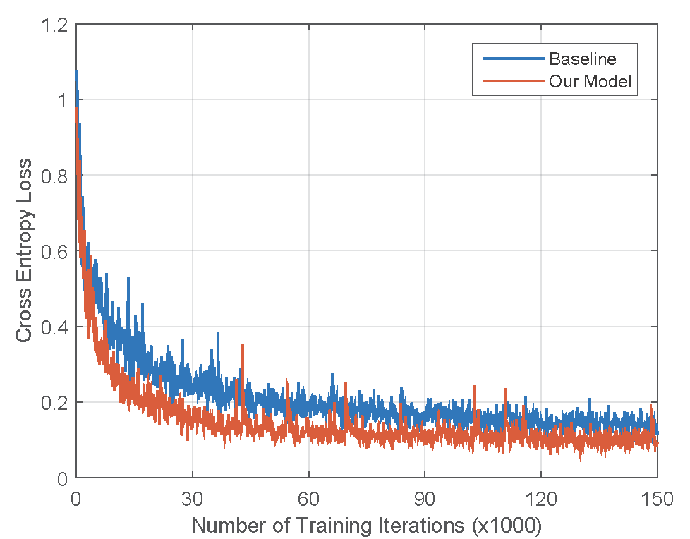

# 3D Unet for Isointense Infant Brain Image Segmentation

This repository includes an (re-)implementation, using updated Tensorflow APIs, of [3D Unet](https://github.com/zhengyang-wang/Unet_3D) for isointense infant brain image segmentation. Besides, we implement our proposed global aggregation blocks, which modify self-attention layers for 3D Unet. The user can optionally insert the blocks to the standard 3D Unet.

For users who wants to use the standard 3D Unet, you need to modify network.py by removing line 62-67 and 72-79. Do not use "_att_decoding_block_layer" in "_build_network". Should you have any question, open an issue and I will respond.

Created by [Zhengyang Wang](http://www.linkedin.com/in/zhengyangwang1991) and [Shuiwang Ji](http://www.linkedin.com/in/shuiwang-ji-9a040715/) at Texas A&M University.

## Publication

Our paper "Global Deep Learning Methods for Isointense Infant Brain Image Segmentation" has been submitted to IEEE Medical Imaging.

## Dataset

The dataset is from UNC and currently not available to the public. Basically, it is composed of multi-modality isointense infant brain MR images (3D) of 10 subjects. Each subject has two 3D images (modalities), T1WI and T2WI, with a manually created 3D segmentation label.

It is an important step in brain development study to perform automatic segmentation of infant brain magnetic resonance (MR) images into white matter (WM), grey matter (GM) and cerebrospinal fluid (CSF) regions. This task is especially challenging in the isointense stage (approximately 6-8 months of age) when WM and GM exhibit similar levels of intensities in MR images.

## Results

Here provides a glance at the effect of our proposed model. The baseline is [3-D Fully Convolutional Networks for Multimodal Isointense Infant Brain Image Segmentation](https://ieeexplore.ieee.org/stamp/stamp.jsp?tp=&arnumber=8287819).

**Visualization of the segmentation results on the 10th subject by our proposed model and the baseline model**:


**Comparison of training processes between our proposed model and the baseline model**:


## System requirement

#### Programming language

Python 3.5+

#### Python Packages

tensorflow-gpu 1.7+, numpy, scipy

## Configure the network

All network hyperparameters are configured in main.py.

#### Training

data_dir: the directory where the input data is stored

num_training_subs: the number of subjects used for training

train_epochs: the number of epochs to use for training

epochs_per_eval: the number of training epochs to run between evaluations

batch_size: the number of examples processed in each training batch

learning_rate: learning rate

weight_decay: weight decay rate

num_parallel_calls: The number of records that are processed in parallel during input processing. This can be optimized per data set but for generally homogeneous data sets, should be approximately the number of available CPU cores.

model_dir: the directory where the model will be stored

#### Validation

patch_size: spatial size of patches

overlap_step: overlap step size when performing testing

validation_id: 1-10, which subject is used for validation

checkpoint_num: which checkpoint is used for validation

save_dir: the directory where the prediction is stored

raw_data_dir: the directory where the raw data is stored

#### Network architecture

network_depth: the network depth

num_classes: the number of classes

num_filters: number of filters for initial_conv

## Training and Evaluation

#### Preprocess data

Before training, we preprocess data into tfrecords format, which is optimized for Tensorflow. A good example of how to preprocess data and use tfrecords files as inputs can be found in utils/generate_tfrecord.py and utils/input_fn.py.

#### Start training

After configure main.py, we can start to train by running
```
python main.py
```

#### Training process visualization

We employ tensorboard to visualize the training process.
```
tensorboard --logdir=model_dir/
```

#### Testing and prediction

If you want to do testing, first make predictions by running
```
python main.py --option='predict'
```

Then, setup evaluation.py and run
```
python evaluation.py
```
